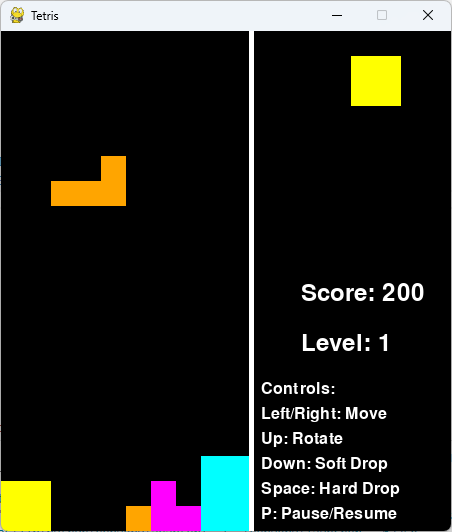

# Tetris Game

This is a simple implementation of the classic Tetris game in Python using Pygame.

## Description

This version of Tetris includes all the classic functionalities, such as line completion, game over state, and scoring system. It also includes a high scores screen and a pause functionality.

## Getting Started

### Prerequisites

- Python (tested with Python 3.11, but may work with earlier versions)
- Pygame 2.4.0 or later

### Installing

git clone https://github.com/cdani/TetrisGame.git
cd TetrisGame
pip install -r requirements.txt
python tetris.py

### Usage

To start the game, run the following command:
python tetris.py

## Controls

- Arrow keys: Move the Tetris piece
- P: Pause the game
- S: Show high scores (when the game is over)
- N: Start a new game (when the game is over)
- ESC: Quit the game or return to the game from the high scores screen

## License

This project is licensed under the MIT License - see the LICENSE file for details.

## Acknowledgments

- This project was inspired by the classic Tetris game.
